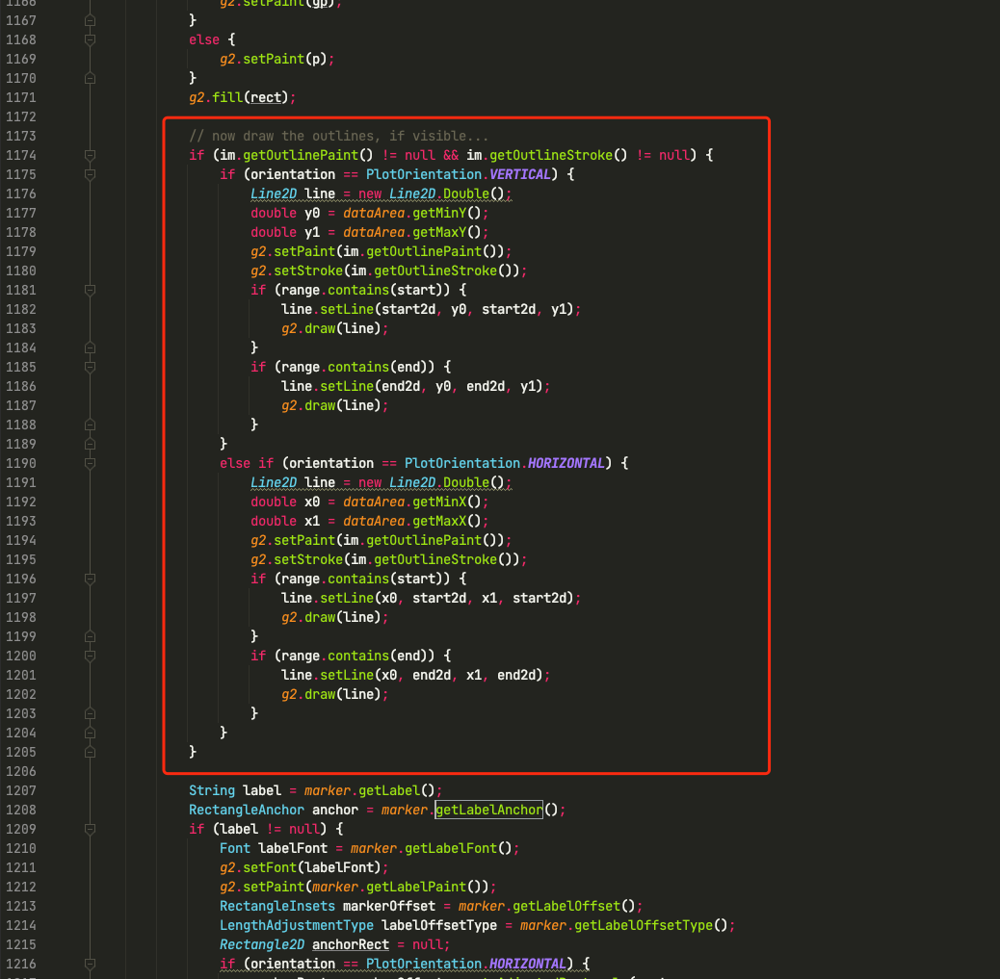
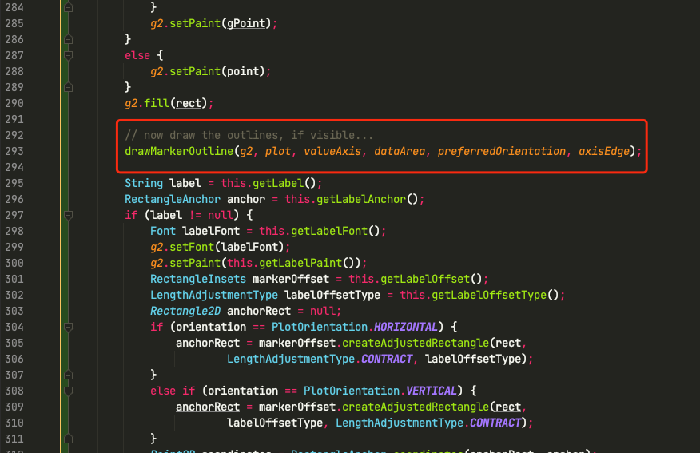
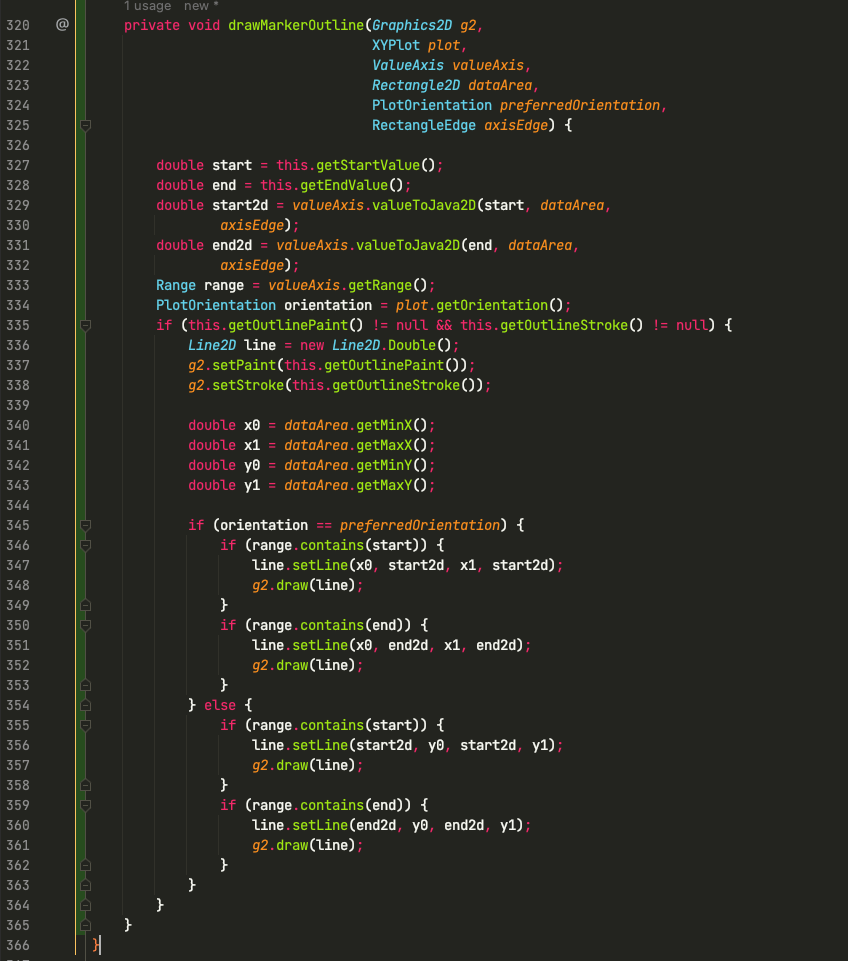

# Midterm 2 Question 2

To see exact code changes, click [here](https://github.com/kolxy/cpts_581_midterm2_q2/compare/master...change). Please let me know once it's graded, I will take the repo down.

Following are the changes I've done for each issue.

## 1. Duplicated code 

**File**: `AbstractXYItemRenderer` <br>
**Line number**: 1062 - 1231, 1242 - 1411 <br>
**Code Smell**: Duplicated code <br>
**Fix**: Extract method

There are a lot of code blocks that resemble each other, thus we need to extract the duplicated code to a new method.

### `drawDomainMarker()` and `drawRangeMarker()`

The code in `drawDomainMarker()` and `drawRangeMarker()` are overtly similar with only a few variables differences. 
Thus, I have extracted the different variables and made a common method `drawAxisMarker()` for these two methods.


## 2. Feature envy

**File**: `AbstractXYItemRenderer` <br>
**Line number**: 1062 - 1231, 1242 - 1411 <br>
**Code Smell**: Feature envy<br>
**Fix**: Move method

After `drawAxisMarker()` is made (*it no longer exists due to refactoring*), I realized that the method heavily depends on the `Marker` class.
So I have moved this method into `Marker.java`. In `AbstractXYItemRenderer.java`, `drawDomainMarker()` and `drawRangeMarker()` simply generate the params and call `marker.drawAxis()` (later emptied due to instanceof refactoring).

## 3. Instance of

**File**: `AbstractXYItemRenderer` <br>
**Line number**: 1068, 1121, 1248, 1301  <br>
**Code Smell**: Instance of<br>
**Fix**: Polymorphism

Note that in the method (after refactoring done in step 2), there is the following piece of code.

```java
public class Marker {
    public void drawAxis() {
        if (marker instanceof ValueMarker) {
            // draw ValueMarker
        }
        else if (marker instanceof IntervalMarker) {
            // draw IntervalMarker
        }
    }
} 
```
In order to get rid of `instanceof`, we made its subclass to handle the draw function like the following code snippet:
```java
public class Marker {
    public void drawAxis() {
        // Do nothing
        // Cannot make this method abstract due to CategoryMarker
    }
} 

public class ValueMarker extends Marker{
    @Override
    public void drawAxis() {
        // draw ValueMarker
    }
}

public class IntervalMarker extends Marker{
    @Override
    public void drawAxis() {
        // draw IntervalMarker
    }
}
```

Therefore, when `marker.drawAxis()` is called in `AbstractXYItemRenderer.java`, the marker should use its own `drawAxis()`.

## 4. Long method

**File**: `AbstractXYItemRenderer` <br>
**Line number**: 1174 - 1205， 1354 - 1385 <br>
**Code Smell**: Long method<br>
**Fix**: Extract method

The following code snippet is originally from `AbstractXYItemRenderer` class (*with original line numbers*):


Since draw outline has its own logic, I decide to make a separate method called `drawMarkerOutline()` in `IntervalMarker` class.
Following images are the refactored code:


